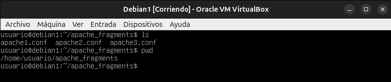
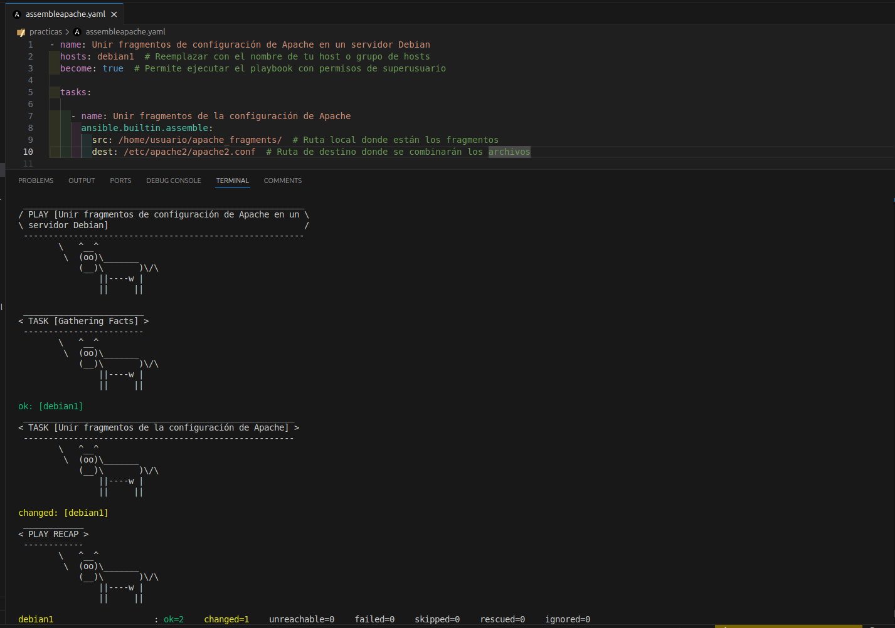
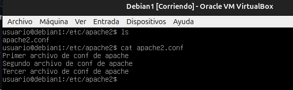

# ANSIBLE

# Estudio del Módulo `assemble` en Ansible

## 1.- Nombre del módulo: `assemble`

### Descripción
El módulo `assemble` de Ansible se utiliza para combinar múltiples archivos en uno solo. Es útil cuando tienes fragmentos de archivos de configuración dispersos y necesitas ensamblarlos en un solo archivo en el nodo remoto. Este módulo es comúnmente utilizado para la gestión de configuraciones complejas y para juntar archivos de forma dinámica.

## 2.- Ejemplos de funcionamiento

### Ejemplo 1: Unir archivos de configuración

Para este playbook necesitaremos archivos de configuracion separados y lo vamos a juntar en uno solo. Por ejemplo de apache. 




```yaml
- name: Unir fragmentos de configuración de Apache en un servidor Debian
  hosts: debian1  # Reemplazar con el nombre de tu host o grupo de hosts
  become: true  # Permite ejecutar el playbook con permisos de superusuario
  tasks:
    - name: Unir fragmentos de la configuración de Apache
      ansible.builtin.assemble:
        src: /home/usuario/apache_fragments/  # Ruta local donde están los fragmentos
        dest: /etc/apache2/apache2.conf  # Ruta de destino donde se combinarán los archivos
```
Comando para lanzar playbook ``` ansible-playbook nombre_playbook```



Observamos que nos aparece changed , vamos a comprobarlo


